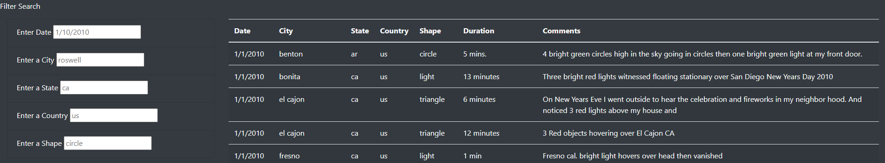

# UFOs

## Overview of Project

The purpose of this project was to create a HTML dashboard or website page. The page holds information pertaining to UFO sightings as well as hosts data that the user can filter by date, city, state, country, or shape.

---

## Results

The UFO Finder webpage can be very helpful in filtering through the sightings data. In the bottom left hand side of the page, there are several options for filtering the data. It can be filtered down by date, city, state, country or shape and can also have multiple filtering objects. Therefore, if the user wanted to filter by city, state, and shape of UFO, the user could enter the information to narrow down the data for specific results. The shape column can be filtered by circle, light, triangle, fireball, formation, sphere, disk, rectangle, unknown, etc.

---

## Summary

One of the drawbacks to this website design are the unknown search variables that can be entered. For example, the user will not know all possible shapes that can be entered into the shape search bar unless they were to scroll through the entire data columns and write down the options. Another limitation is the date filter for the time periods of the UFO sightings. Are the sightings only in 2010 or are there other years of data sightings. To go further, the ability to filter by year rather than a string date and then by month and day separately could give the user even more filtering power. I would recommend in the future using a check box filter or having a drop down recommendations in the text boxes.

---

### Resources

- APP File: [app.js](static/js/app.js)
- CSS File: [style.css](static/css/style.css)
- Data: [data.js](static/js/data.js)
- HTML File: [index.html](index.html)
